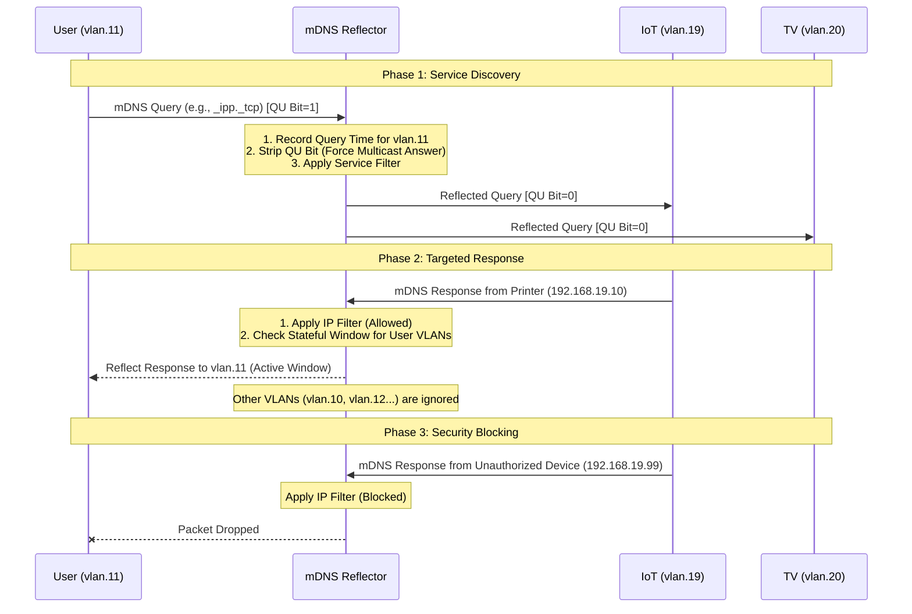

# mdns-reflector

A high-performance, Go-based mDNS reflector designed for complex networks with many VLANs. Built using the latest **miekg/dns v2** library for maximum throughput and minimal latency.

## Features
- **miekg/dns v2 Core:** Leverages the major rewrite of the industry-standard DNS library for significantly improved performance on embedded hardware.
- **Interface Grouping:** Manage 50+ VLANs by grouping them (e.g., `users`, `gl_iot`, `gl_tv`).
- **IP-Based Filtering:** Strictly limit which devices can reflect services (e.g., only specific printer/scanner IPs).
- **Directional Rule Enforcement:** Define exactly how traffic flows (e.g., Queries: Users -> IoT; Responses: IoT -> Users).
- **Stateful Discovery Window:** Only reflects responses back to VLANs that have sent a query in the last 60 seconds. This prevents one response from being flooded across all 50+ VLANs simultaneously.
- **Multicast Enforcement (QU-bit Stripping):** Automatically modifies queries to force devices to respond via Multicast, ensuring the reflector can "hear" and forward responses from devices that might otherwise try to respond via Unicast across VLAN boundaries.

## Architecture & Logic
1. **Listeners:** Binds once to `0.0.0.0:5353` and joins the mDNS multicast group (`224.0.0.251`) on all configured sub-interfaces.
2. **Packet Inspection:** Uses the `github.com/miekg/dns` library to parse packets and identify if they are Queries or Responses.
3. **State Tracking:** When a "User" VLAN sends a query, the app opens a 60-second window for that specific interface to receive responses.
4. **Reflection:** Packets are reflected across interfaces while preserving the original mDNS data but stripping the "Unicast Response" (QU) bit from queries to ensure visibility.

## How it Works



## Understanding the Logs (mDNS Record Types)

In the logs, you will see various DNS record types. These are standard mDNS record types (RFC 6762) used during discovery:

| Type | Full Name | Purpose in Discovery |
| :--- | :--- | :--- |
| **PTR** | Pointer Record | **Discovery:** Maps a service type (e.g., `_ipp._tcp`) to a specific device name. This is usually the first packet seen. |
| **SRV** | Service Record | **Resolution:** Provides the **Port Number** and the **Hostname** for a specific service. |
| **TXT** | Text Record | **Details:** Contains key-value pairs with extra info (e.g., printer model, scan resolution, AirPlay version). |
| **A** | Address (IPv4) | **Location:** Maps a hostname (e.g., `printer.local`) to its **IPv4 address**. |
| **AAAA** | Address (IPv6) | **Location:** Maps a hostname to its **IPv6 address**. |
| **ANY** | Any Record | **Probe:** A generic query often sent by OSs during startup to find any available records for a name. |

### Example Discovery Flow in Logs:
1. **Query (PTR):** "Who is an AirPlay device?"
2. **Response (PTR):** "I am 'Roku Event Back'."
3. **Query (SRV/TXT):** "What port does 'Roku Event Back' use and what are its features?"
4. **Query (A):** "What is the IP address of 'X02800M8GX3H.local'?"

## Configuration Example

```yaml
# config.yaml
interfaces:
  - { name: "vlan.10", group: "users" }
  - { name: "vlan.19", group: "gl_iot" }
  - { name: "vlan.20", group: "gl_tv" }
  # ... add more interfaces ...

rules:
  # 1. Users can ONLY send specific service queries to Service Networks
  # This blocks background OS noise like reverse DNS lookups.
  - from: "users"
    to: ["gl_iot", "gl_tv"]
    types: ["query"]
    filter:
      allowed_services:
        - "_ipp._tcp"            # Printing
        - "_printer._tcp"
        - "_scanner._tcp"        # Scanning
        - "_airplay._tcp"        # Apple AirPlay
        - "_googlecast._tcp"     # Chromecast
        - "_spotify-connect._tcp"
        - "_services._dns-sd._udp" # General Meta-Query

  # 2. IoT Network only sends RESPONSES to Users (from specific IPs)
  - from: "gl_iot"
    to: ["users"]
    types: ["response"]
    filter:
      allowed_ips:
        - "192.168.19.10" # Printer
        - "192.168.19.11" # Scanner

  # 3. TV Network only sends RESPONSES to Users
  - from: "gl_tv"
    to: ["users"]
    types: ["response"]
```

## Testing Guide

Use `avahi-browse` on a client machine to verify discovery.

### 1. Test Printers (IPP)
```bash
avahi-browse -rt _ipp._tcp
```

### 2. Test Apple AirPlay (TVs/Audio)
```bash
avahi-browse -rt _airplay._tcp
```

### 3. Test Google Cast / Chromecast
```bash
avahi-browse -rt _googlecast._tcp
```

### 4. Search all services (Meta-query)
```bash
avahi-browse -at
```

## Deployment on Raspberry Pi (aarch64)

1. **Build:**
   ```bash
   make cross-compile
   ```
2. **Copy to Pi:**
   Transfer `bin/mdns-reflector-pi` and `config.yaml` to the Pi.
3. **Run:**
   ```bash
   sudo ./mdns-reflector-pi
   ```
